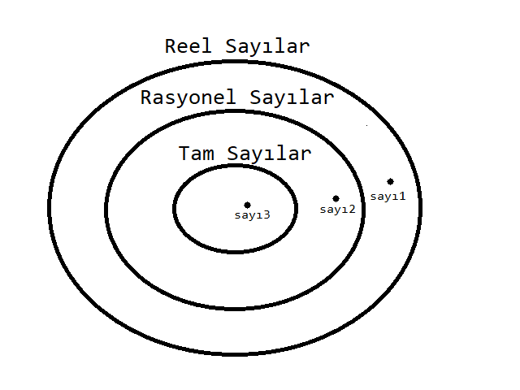

## ÖRNEK_1

* Bir  <u>Reel sayılar</u> kümemiz olsun,

* ve bu reel sayının alt kümeleri olan `Rasyonel sayılar`
ve `Tam sayılar` olsun,

* Rasyonel Sayılar kümesi üzerinden Tam sayılara doğru bağlı liste
yapısı oluşturacağız.

>Her bir küme, içerisinde bir tane sayı tutacak.

*Yapı, görsel olarak:*

şeklinde olmalıdır.

---

Not: Kalıtım kullanınız.