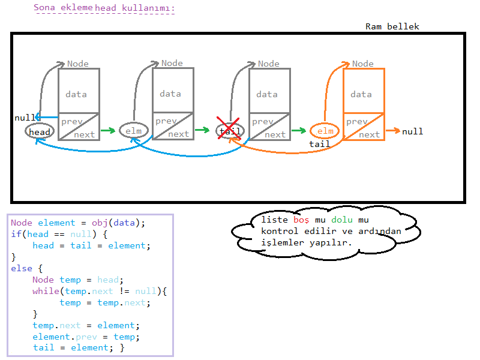
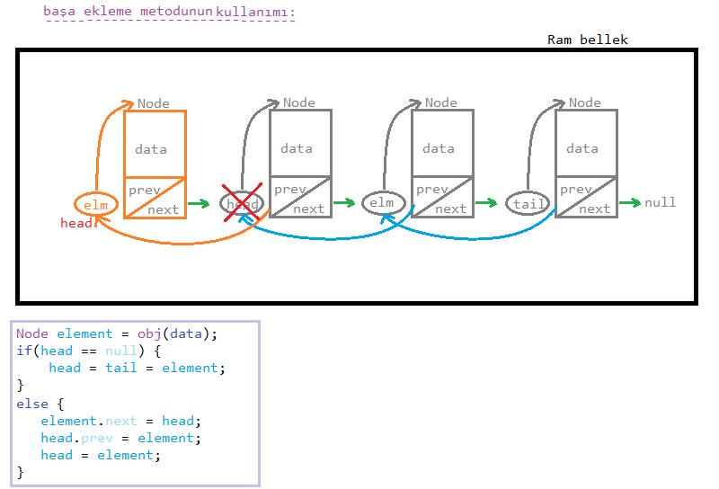
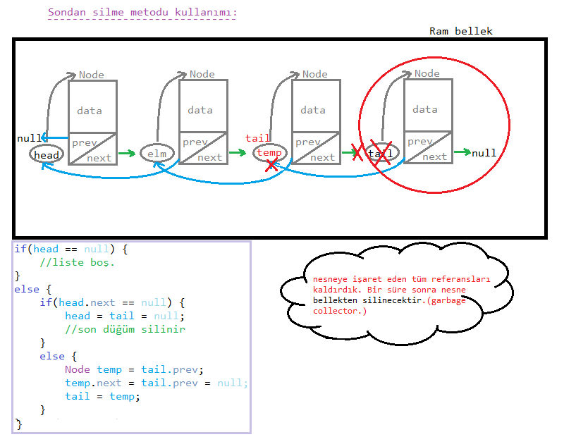
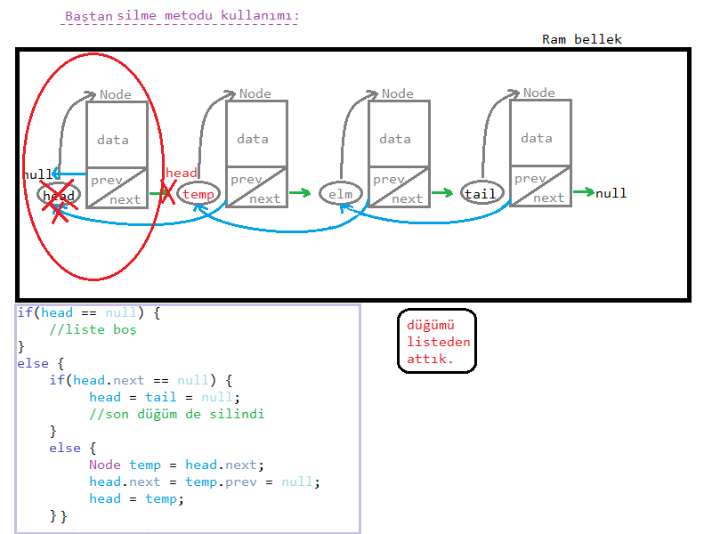

<font face="chinese rocks" color="pink" size="6px"><h3></h3></font>

<font face="chinese rocks" color="pink" size="6px"><h3>Node Kurulumu:</h3></font>

oluşturacağımız tüm düğümleri temel alan sınıfın şablonu:

```java
public class Node{
    int data; //tutulacak veri
    Node next, prev;

    Node(int data){
        this.data = data;
        next = prev = null;
    }
}
```

şeklinde olacaktır.

---

<font face="chinese rocks" color="pink" size="6px"><h3>Liste Kurulumu:</h3></font>

bir liste oluşturulurken kurulacak metodlardan önce `baş ve son düğüm` tanımlanır:

```java
public class List{
   private Node head, tail;

    List(){
        head = tail = null;
    }
}
```

liste ilk oluşturulduğunda varsayılan olarak `null` değerlikli olacaktır.

---

<font face="chinese rocks" color="pink" size="6px">Düğüm Oluşturma obj(); Metodu<h3></h3></font>

bu metod, parametre olarak verileri alıp bizlere bir düğüm döndürecektir.

veri gizliliği açısından `private yapılır`.

```java
private Node obj(int data){
    Node element = new Node(data);
    return element;
}
```

---
<font face="chinese rocks" color="pink" size="6px"><h3>Sona ekleme metodu (head kullanımı):</h3></font>



---
yukarıda görmüş olduğumuz `yapıda tail' e ihtiyaç kalmaz`. Çünkü tail düğümünün yapacağı işi `temp` devralır.

*eğer tail içeren yapı kurmak istiyorsak:*

```java
public class List { 
    void addLast(int data) {
        Node element = obj(data);
        if(head == null) {
            head = tail = element;
            System.out.println("Liste oluşturuldu ve ilk düğüm eklendi.");
        }
        else {
            tail.next = element;
            element.prev = tail;
            tail = element;
            System.out.println("Sona düğüm eklendi."); 
        }
    }
}
```
> şeklinde yapacağız. Ben de algoritmaları kurarken kısa yollardan kuracağım.

<font face="chinese rocks" color="pink" size="6px"><h3>Başa ekleme metodu:</h3></font>



---

* keyfinize göre `temp'li` kullanımı da seçebilirsiniz.
* temp'li kullanım nasıl olacak diye sorabilirsiniz. Tabiki `tail kullanarak` olacaktır.

*başa ekleme -tail kullanımı-*

```java
public class List {
    void addLast(int data) {
        Node element = obj(data);
        if(head == null) {
            head = tail = element;
        }
        else {
            Node temp = tail;
            while(temp.prev != null) {
                temp = temp.prev;
            }
            element.next = temp;
            temp.prev = element;
            head = element;
        }
    }
}
```
farklı yöntemler keyifli olacaktır.

**baştan/sondan silme işlemleri için aynı bu yapı kullanılabilir ama kullanışlı olması açısından kısa yollardan gideceğiz.**

> dikkat ederseniz <u>bir başlangıç yada bir bitiş</u> düğümüyle bile  veri yapıları kolayca tanımlanabiliyor.

<font face="chinese rocks" color="pink" size="6px"><h3>Sondan Sİlme Metodu:</h3></font>



>tail'e ihtiyaç duymuyorsanız `temp`'li kullanım yapabilirsiniz.

---

<font face="chinese rocks" color="pink" size="6px"><h3>Baştan silme metodu:</h3></font>



#### ÖDEV:

> `ekrana düğümleri yazdırma` ve `düğüm sayısını döndürme` metodlarını kendiniz <u>iki farklı şekilde</u> oluşturunuz.

ödevi karşılaştırmak için [ÖDEV.md](images/ÖDEV.md) dosyasına bknz.

**Hazırlayan:** Berat Kurt