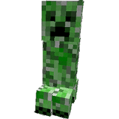

<font face="chinese rocks" color="pink" size="6px"><h2>Ödev Cevapları:</h2></font>

* <u>baş düğümden başlanarak</u> yazdırma metodu: `print();`

* <u>son düğümden başlanarak</u> yazdırma metodu: `tnirp();`

* <u>baş düğümden başlanarak</u> düğüm sayma metodu: `numberH();`

* <u>son düğümden başlanarak</u> düğüm sayma metodu: `numberT();`

isimleri verilerek algoritmalar kurulmuştur.

<font face="new times roman" color="green"><h2>print(); metodu:</h2></font>

```java
public class List {
    void print() {
        if(head == null) {
            System.out.println("-- Liste boş --");
        }
        else {
            Node temp = head;
            System.out.println("-- Liste --");
            for(int i = 1; temp != null; i++){
                System.out.println(i + ") " + temp.data);
                temp = temp.next;
            }
            System.out.println("-----------");
        }
    }
}
```

---

<font face="new times roman" color="green"><h2>tnirp(); metodu:</h2></font>

```java
public class List {
    void tnirp() {
        if(tail == null) {
            System.out.println("-- Liste boş --");
        }
        else {
            Node temp = tail;
            System.out.println("-- Liste --");
            for(int i = 1; temp != null; i++){
                System.out.println(i + ") " + temp.data);
                temp = temp.prev;
            }
            System.out.println("-----------");
        }
    }
}
```
---

<font face="new times roman" color="green"><h2>numberH(); metodu:</h2></font>

```java
public class List {
    int numberH() {
        int i = 1;
        if(head == null) {
            return (i-1);
        }
        else {
            Node temp = head;
            while(temp.next != null) {
                temp = temp.next;
                i++;
            }
            return i;
        }
    }
}
```

---

<font face="new times roman" color="green"><h2>numberT(); metodu:</h2></font>

```java
public class List {
    int numberT() {
        int i = 1;
        if(tail == null) {
            return (i-1);
        }
        else {
            Node temp = tail;
            while(temp.prev != null) {
                temp = temp.prev;
                i++;
            }
            return i;
        }
    }
}
```

---
**Hazırlayan:** Berat Kurt


