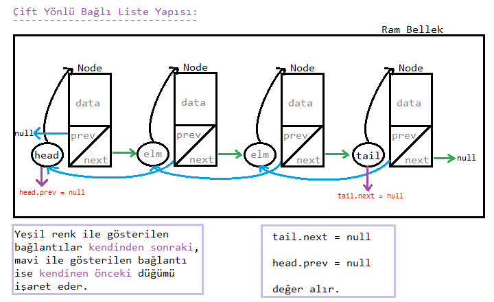

<h3>Çift Yönü Bağlı Liste Nedir ?</h3>

* bir düğümün ` iki tane göstericisi` olduğu ve birinin <mark>sonraki(next)</mark>, diğerinin <mark>önceki(prev)</mark> düğümü gösterdiği yapıya denir.

* Tek yönlü bağlı listelerde her bir düğüme yanlızca next(sonraki) göstericisi ile gidilebiliyodu. Şimdi ise bir düğüm üzerinde `hem ileri`, `hem geri` gidebilecek bir düğüm yapısı tasarlayacağız.

* Çift yön, bağlı listelerde bizlere çok fazla esneklik ve seçenek sunar.

**En Çok Nerede Kullanır ?**

>şarkı uygulamaları,

>arama motoru üzerinde önceki ve sonraki sayfaya yönlendiren tuşlar 

örnek olarak verilebilir.

---

* görsel olarak aşağı yukarı böyle görünür :) 

#### Ekstra özellikler:

* <u>tail (kuyruk):</u> listenin son düğümünü tutar.

* <u>head (baş):</u> -bildiğimiz üzere- listenin baş düğümünü tutar

* <u>prev (previous - önceki):</u> kendinden önceki düğümü tutan göstericidir.

* <u>next (sonraki):</u> kendinden bir sonraki düğümü tutan göstericidir.

> şimdilik başaEkle, sonaEkle, baştanSil, sondanSil, verileri yazdırma işlemleri göreceğiz.

**Çift yönlü bağlı listede algoritmaların iki şekilde de kurulabileceğini unutmayınız.**

*HAZIRLAYAN:* Berat Kurt

---

