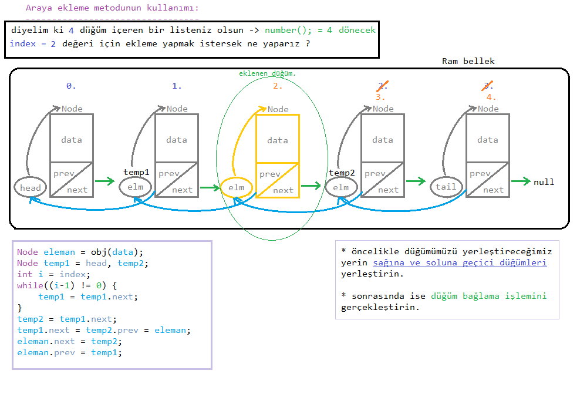
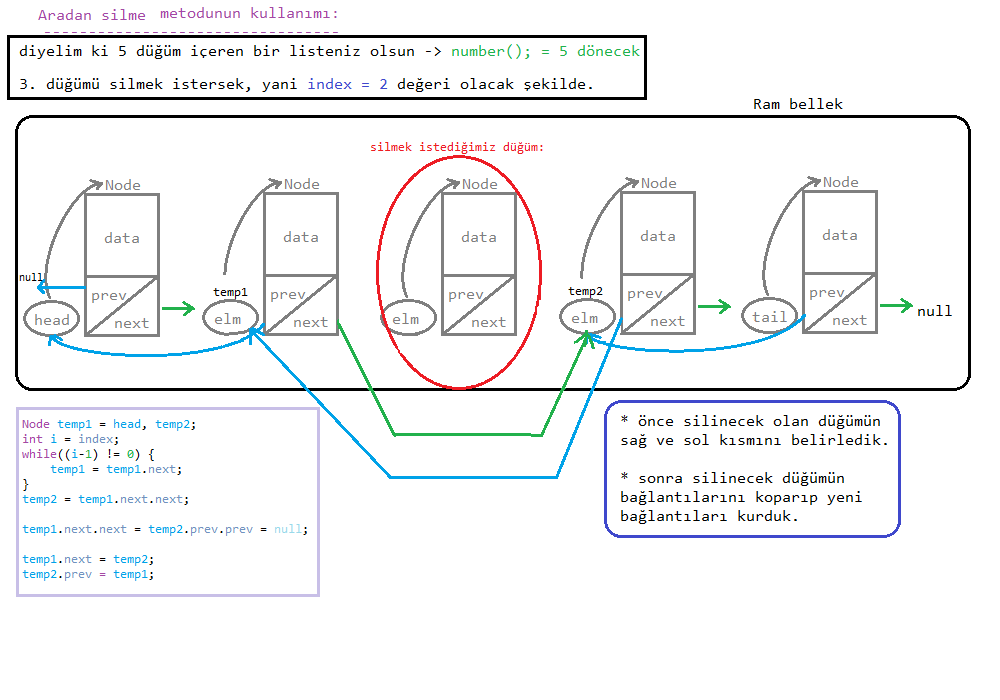

<h3>ARAYA DÜĞÜM EKLEME-SİLME İŞLEMİ:</h3>

* önceki yapıları dikkate alarak metodların indeks parametrelerinin de olacağını unutmayınız.

* <u>sorulması gereken temel sorular arasında:</u>

>indeks `doğru yazılmış mı`, `liste boş mu`, `indeks geçerli aralıkta mı` ? gibi sorular sormamz gerekecek.

<h3>Araya ekleme: addBetween metodu:</h3>

|||
|-|-|
|1. soru:|indeks değeri doğal sayı mı?|
|2. soru:|indeks değeri geçerli aralıkta mı?|
|3. soru:|indeks değeri `son` veya `ilk sıra` değerini mi almış?|

* sonra da araya ekleme işlemi ne gerektiriyorsa o yapılır.

> eğer aradan çıkarama işlemi yapıyorsak, o zaman 2. sorunun yerine 
`"Liste boş mu ?"` diye bir soru sorabiliriz.

##### addBetween kullanımı:

şeklinde uygulanır. 

> Şekilden de az çok birşeylerin anlaşılacağını düşündüğüm için açıklama gereği duymayacağım.

---

##### deleteBetween kullanımı:

---

bir sonraki derste güzel bir şarkı uygulaması yapayı planlıyorum. 
Şimdilik en baştaki işlediğimiz konulara kadar <u>tekrar</u> ediniz :)

*Author:* Berat Kurt